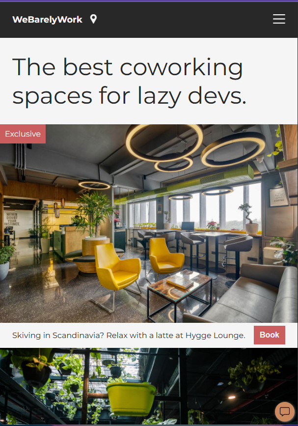

# Coworking Space 

Its a simple layout for a coworking space site.The main goal of this project was to practice and apply core CSS concepts I learned in the module, especially around writing clean, efficient, and maintainable styles.


## 📸 Screenshot

  



## 🛠️ Tech Used

* HTML5 – Markup for the project.

* CSS3 – Styles and layout practice.

  
## 📌 Key Takeaways

* Learned how to balance between utility classes and specific selectors.

* Improved understanding of positioning elements in different contexts.

* Practiced writing cleaner CSS with minimal duplication.

* Built confidence in targeting elements smartly with selectors.

## 🚀 How to View

1. Clone this repo:

```bash
    git clone github.com/razzongit/coworking-space
```

2. Open index.html in your browser


---
## 📚 About the Course

This project is part of my progress in the Full Stack Developer Career Path on Scrimba.